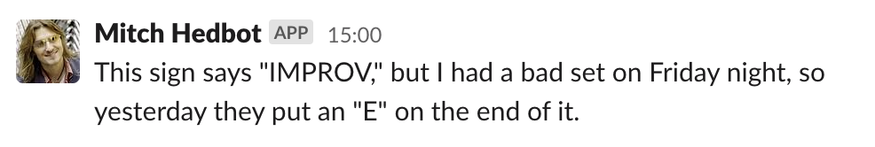

# Mitch Hedbot

[Mitch Hedberg](https://en.wikipedia.org/wiki/Mitch_Hedberg) was an American stand-up comedian known for his surreal humor and deadpan delivery.

## Implementation

The code is run as an [AWS Lambda function](https://en.wikipedia.org/wiki/AWS_Lambda). A cron job is run with [Amazon EventBridge](https://aws.amazon.com/eventbridge/) that through a [web hook](https://api.slack.com/messaging/webhooks) integrates with a Slack app that prints one of Mitch's quotes in a pun Slack channel each Friday.

